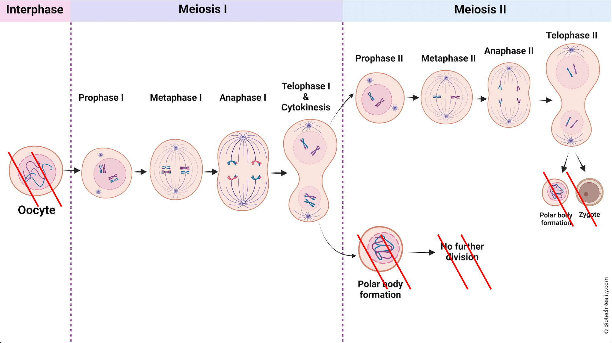
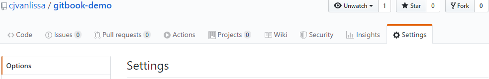
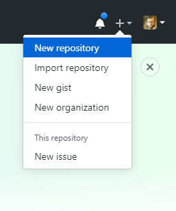
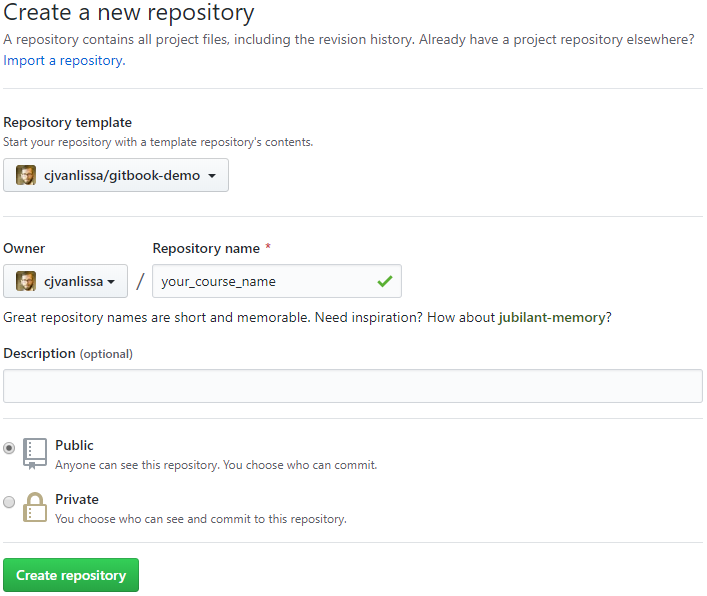
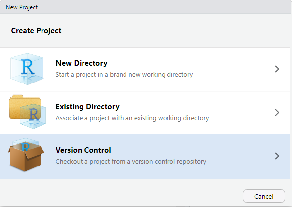
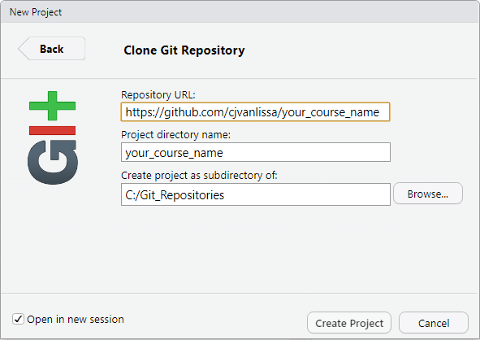
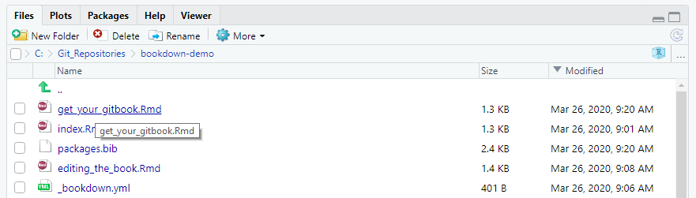
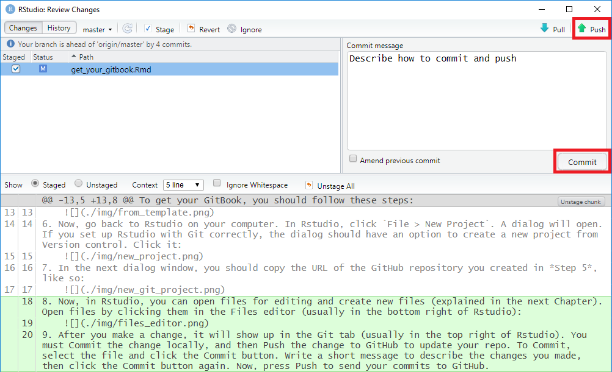
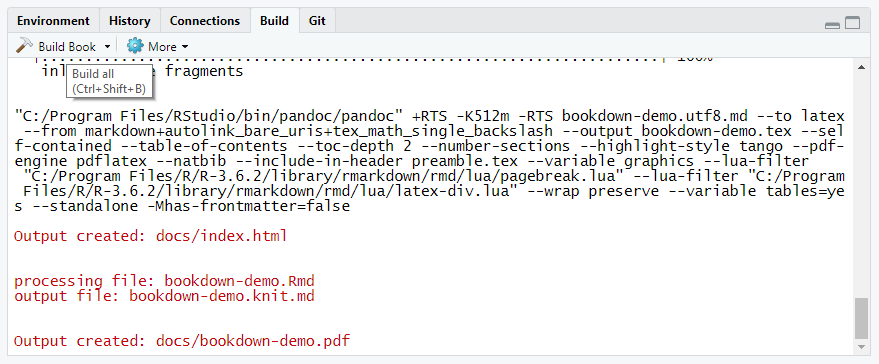
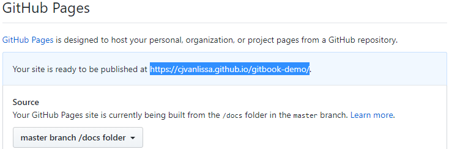

--- 
title: "G8 Biology Guidebook"
author: "[Page Tsien](https://pagius5.github.io/)"
date: "`r Sys.Date()`"
description: This GitBook is an example of a GitBook for teaching. It can be 
  adapted for specific courses. The output format for this example
  is bookdown::gitbook.
documentclass: book
github-repo: Pagius5/G8-Biology
link-citations: yes
bibliography:
- book.bib
- packages.bib
site: bookdown::bookdown_site
biblio-style: apalike
---

# Overview


A *GitBook* is a useful tool for creating (open?) educational resources. It is an online "book" format, that can be hosted directly from a GitHub repository. You are currently reading a GitBook designed to help you get started creating your own educational GitBooks for your courses (how meta!). It does this in two ways: By explaining how to create GitBooks, and by serving as a template that you can copy and edit, instead of having to start from scratch. This template GitBook has all the settings that I consider to be useful for educational GitBooks, but you can always customize it.

I will focus specifically on GitBooks that are made in [Rstudio](https://rstudio.com), using the [`rmarkdown` markup language](https://rstudio.com/wp-content/uploads/2016/03/rmarkdown-cheatsheet-2.0.pdf), rendered using the [`bookdown` package](https://bookdown.org/yihui/bookdown/get-started.html), and hosted on [GitHub](https://github.com/). If you want to get started, skip ahead to Chapter \@ref(prerequisites); if you need more convincing, keep reading below.

**To spead the workload**

My challenge was that I had to translate all tutorial instructions from proprietary software to R, and there was not enough time to complete this task before the course commenced. By making the tutorial instructions available in [this GitBook](https://cjvanlissa.github.io/TCSM/), I was able to continue translating tutorial instructions *while the semester was ongoing*, and push updates to GitHub in time for each session, which were immediately available to all students. The parallel with the current situation is that some courses are now forced to start teaching in an online format, without having enough time to completely prepare. By using a GitBook, you can spread out the workload of preparing your materials across the semester. [This is the finished GitBook](https://cjvanlissa.github.io/TCSM/)

**To contribute or use existing Open Educational Resources**

Another key advantage of using a GitBook is, that you can easily make your course materials available for others to use under an open access license, or perhaps you can use an existing GitBook from the internet and adapt it for your own uses. GitBooks can be easily duplicated and adapted, just like any other project hosted on GitHub. Contributing Open Educational Materials can help reduce the workload on teachers around the world, and can improve the quality of the materials used thanks to online collaborating and feedback.

**To benefit from formatting advantages**

GitBooks also have two formatting advantages over classic PDF or Word files. First, they are Rmarkdown files, and can thus include blocks of R ([or Python](https://rstudio.github.io/reticulate/articles/r_markdown.html)) code that can be evaluated, and whose results are rendered to the file. Second, they are interactive web pages, and as such, can have dynamic features (such as answers to assignments that can be hidden, or boxes where students can fill out an answer to be checked). Additionally, other web pages or interactive apps can be embedded within the page. So whereas a traditional document is static, GitBooks can be interactive.

**How do GitBooks work?**

GitBooks consist of an Rstudio project, with several Rmarkdown files containing the chapters of the book. Inside Rstudio, users can press a "Build Book" button, which renders all of these chapters to a nicely formatted HTML book (and a PDF file for users to download). Users can push the finished book to a GitHub repository, and indicate on GitHub that the book should be hosted on GitHub pages. Voilà!
  
**Getting started**
  
If you are convinced that this tool might benefit your teaching, your first point of action is to prepare your system for creating GitBooks (Chapter \@ref(prerequisites)). After that, you can get a copy of this GitBook as a template (Chapter \@ref(getgitbook)). Then, you can start tweaking it for your own course!


<!--chapter:end:index.Rmd-->

# Chapter I: From A Cell To An Organism

<!--chapter:end:ch1.Rmd-->

## Lecture 1: Cell Cycle

<!--chapter:end:l1.Rmd-->

## Lecture 2: Cell Division

<!--chapter:end:l2.Rmd-->

## Lecture 3: Levels of Organization

<!--chapter:end:l3.Rmd-->

## Experiment 1: Observing Mitosis In Plant Cells

<!--chapter:end:exp1.Rmd-->

## Experiment 2: Cell Differentiation

<!--chapter:end:exp2.Rmd-->

## Project 1: Mitosis & The Cell Cycle

<!--chapter:end:p1.Rmd-->

## Project 2: Biological Organization

This GitBook is created in Rstudio, using the `bookdown` package. To get your system set up correctly, you have to install several software packages, and register on GitHub. You only have to perform these steps once, and the entire process should take approximately 1 hour if you start from scratch. In case some software is already installed on your system, you can skip related steps. Follow these steps in order:

1. Install R from [cloud.r-project.org](https://cloud.r-project.org/)
2. Install Rstudio Desktop (Free) from [rstudio.com](https://rstudio.com/products/rstudio/download/#download)
<!-- ALWAYS RUN AS ADMIN -->
<!-- install rtools -->
3. Install Git from [git-scm.com](https://git-scm.com/downloads). Use the default, recommended settings. It is especially important to leave these settings selected:
    + Git from the command line and also from third party software
    + Use the OpenSSL library
    <!--*For secure data transfer with GitHub*-->
    + Checkout Windows-style, commit Unix-style line endings
    <!--*This is the preferred setting when collaborating with others on different platforms. Be prepared that, on windows, you will receive harmless notifications about LF to CRLF line endings.  *-->
    + Enable Git Credential Manager
    <!--*For logging in to GitHub*-->
    + If you run into any trouble, a more comprehensive tutorial on installing Git is available at [happygitwithr.com](https://happygitwithr.com/install-git.html).
4. Register on GitHub
    + Go to <https://github.com/> and click "Sign up". Choose an "Individual", "Free" plan.
    + Request a [free academic upgrade](https://help.github.com/en/articles/applying-for-an-educator-or-researcher-discount). This allows you to create *private repositories*, which are only visible to you and selected collaborators, and can be made public when your work is published.
5. Connect Rstudio to Git and Github (for more support, see [this Rstudio article](https://support.rstudio.com/hc/en-us/articles/200532077-Version-Control-with-Git-and-SVN), and [this blog post](https://www.r-bloggers.com/rstudio-and-github/))
    a. Open Rstudio, open the Tools menu, click *Global Options*, and click *Git/SVN*
    b. Verify that *Enable version control interface for RStudio projects* is selected
    c. Verify that *Git executable:* shows the location of git.exe. If it is missing, manually fix the location of the file.
    d. Click *Create RSA Key*. Do not enter a passphrase. Press *Create*. A window with some information will open, which you can close.
    e. Click *View public key*, and copy the entire text to the clipboard.
    f. Close Rstudio (it might offer to restart by itself; this is fine)
    g. Go to <https://github.com>
    h. Click your user icon, click *Settings*, and then select the *SSH and GPG keys* tab.
    i. Click *New SSH key*. Give it an arbitrary name (e.g., your computer ID), and paste the public key from your clipboard into the box labeled "*Key*".
    j. Open Rstudio again (unless it restarted by itself)
6. Install all required packages by running the following code in the Rstudio console. Be prepared for three contingencies:
    + If you receive any error saying *There is no package called XYZ*, then run the code `install.packages("XYZ")`
    + If you are prompted to update packages, just press `3: None`. Updating packages this way in an interactive session sometimes leads to errors, if the packages are loaded.
    + If you see a pop-up dialog asking *Do you want to install from sources the package which needs compilation?*, click *No*. If this leads to errors, then please follow *Step 3* from [this online guide](https://cjvanlissa.github.io/worcs/articles/setup.html), and run `install.packages("devtools")`. This will take a long time, but will allow you to install packages from source.

Run the following code to install the required packages:

```{r eval=FALSE}
install.packages("bookdown")
install.packages("tinytex")
tinytex::install_tinytex()
git2r::config(global = TRUE, user.name = "your.name", user.email = "your.email")
```

That's it! Everything should be installed and connected now.

```{r include=FALSE}
# automatically create a bib database for R packages
knitr::write_bib(c(
  .packages(), 'bookdown', 'knitr', 'rmarkdown'
), 'packages.bib')
```

<!--chapter:end:p2.Rmd-->

# Chapter II: Reproduction Of Organisms


<!--chapter:end:ch2.Rmd-->

## Lecture 4: Sexual Reproduction


### Lesson outline

**A. What is sexual reproduction?**  
1. <u>Sexual reproduction</u> produces an offspring when genetic materials from two 
different sex cells combine.  
a. The female sex cell, a(n) <u>egg</u>, forms in an ovary.  
b. The male sex cell, a(n) <u>sperm</u>, forms in a testis.   
2. During a process called <u>fertilization</u>, an egg cell and a sperm cell join together. The 
new cell that forms is called a(n) <u>zygote</u>.  

**B. Diploid Cells**  
1. Organisms that reproduce sexually make two kinds of cells—<u>body</u> cells and sex cells.  
2. Body cells are <u>diploid</u>; they have pairs of chromosomes.  
3. If a zygote has too many or too few <u>chromosomes</u>, it will not develop properly.  
4. Different organisms have different <u>numbers</u> of chromosomes.  
5. <u>Homologous chromosomes</u> are pairs of chromosomes that have genes for the same traits arranged in the same order.  

**C. Haploid Cells**  
1. Sex cells are <u>haploid</u>; they have only one chromosome from each pair of chromosomes.  
2. In <u>meiosis</u>, one diploid cell divides and makes four haploid cells.  

### Homework
\begin{equation*} 
\frac{d}{dx}\left( \int_{a}^{x} f(u)\,du\right)=f(x)
\end{equation*} 

<!--chapter:end:l4.Rmd-->

## Lecture 5: Meiosis-1

### Lesson outline  
**D. The Phases of Meiosis**  
1. Meiosis involves two divisions of the nucleus and the <u>cytoplasm</u>. These divisions, known as meiosis I and meiosis II, result in four haploid cells.  
2. During <u>interphase</u>, the reproductive cell grows and duplicates its chromosomes.  
3. During meiosis I, each pair of duplicated homologous chromosomes <u>separates</u>.  
4. After meiosis I, the two cells formed during this stage go through a second division of the <u>nucleus</u> and cytoplasm called meiosis II. During meiosis II, sister <u>chromatids</u> separate to produce four haploid cells.  

**E. Why is meiosis important?**  
1. Meiosis forms sex cells with the correct haploid number of <u>chromosomes</u>. This maintains the correct <u>diploid</u> number of chromosomes in organisms when sex cells join. Meiosis creates genetic variation by producing <u>haploid</u> cells.

<!--chapter:end:l5.Rmd-->

## Lecture 6: Meiosis-2
Lesson outline
1. interphase
2. Homologous chromosomes
3. breaks 
4. middle 
5. Spindle 
6. homologous 
7. Sister chromatids 
8. two 
9. Sister chromatids 
10. Chromosomes; Nuclear membrane 
11. align 
12. pulled apart; opposite ends of the cells 
13. chromosomes 
14. four 
15. half

<!--chapter:end:l6.Rmd-->

## Lecture 7: Meiosis-3



Lesson outline


F. How do mitosis and meiosis differ? 
1. During mitosis and cell division, a body cell and its nucleus divide once and produce two 
identical cells. 
2. During meiosis, a reproductive cell and its nucleus divide twice and produce four cells––two 
pairs of identical haploid cells. 
G. Advantages of Sexual Reproduction 
1. Sexual reproduction produces offspring that have a new combination of DNA. This results in 
genetic variation among individuals. 
2. Genetic variation gives individuals within a population slight differences that might be an 
advantage if the environment changes. 
3. Selective breeding has been used to develop desirable traits in plants and animals. 
H. Disadvantages of Sexual Reproduction 
1. One disadvantage of sexual reproduction is that organisms have to grow and develop until 
they are mature enough to produce sex cells. 
2. Another disadvantage is that searching for a mate takes time and energy and might expose 
individuals to predators, diseases, or harsh environmental conditions.

<!--chapter:end:l7.Rmd-->

## Lecture 8: Asexual Reproduction

To get your GitBook, you should follow these steps:

1. Go to <https://github.com/cjvanlissa/gitbook-demo>
2. In the top right of the page, click `Fork`.  
    This will copy my `gitbook-demo` repository to your GitHub account.  
    
3. My repository is now copied to your account. It is a template repository, which means that you can create a *new repository* based on this one.
4. Create a new repository for your own GitBook. Create one for a course you've been wanting to update. In the top-right corner of the GitHub website, click the + icon, and select "New repository":  
    
5. In the dialog, select the `gitbook-demo` as "Repository template", and give the repository an appropriate name for your course. Then, press `Create repository`:  
    
6. Now, go back to Rstudio on your computer. In Rstudio, click `File > New Project`. A dialog will open. If you set up Rstudio with Git correctly, the dialog should have an option to create a new project from Version control. Click it:  
    
7. In the next dialog window, you should copy the URL of the GitHub repository you created in *Step 5*, like so:  
    
8. Now, in Rstudio, you can open files for editing and create new files (explained in the next Chapter). Open files by clicking them in the Files editor (usually in the bottom right of Rstudio):  
    
9. After you make a change, it will show up in the Git tab (usually in the top right of Rstudio). You must Commit the change locally, and then Push the change to GitHub to update your repo. To Commit, select the file and click the Commit button. Write a short message to describe the changes you made, then click the Commit button again. Now, press Push to send your commits to GitHub.  
    
10. To render your book as a GitBook, you must "Build" it. In the top-right panel of Rstudio, you see a "Build" tab. In this tab, simply click the "Build Book" button to build your book. You should see a lot of rendering messages, until a window pops up with your brand new GitBook. If you get errors at this stage, you probably made a mistake in preparing your system (see the previous Chapter).  
    
11. Building the book generated a lot of new files in the `./docs` directory. This directory contains the website files for your GitBook. Open the Git tab again, verify that the `./docs` directory is listed, and Commit and Push all of these new files as described in *Step 9*.
12. There is only one last remaining task: To publish your GitBook on GitHub pages. Once you do this, any change to the `./docs` folder that you push to GitHub will lead to an immediate update of your GitBook website. Go back to the GitHub page for your Repository. Click on the `Settings` tab on the top right of the page:  
    
13. On the Settings page, scroll all the way down until you reach a section called `GitHub Pages`. There, under the "Source" heading, click the word `None`, and select `master branch /docs folder`. When you select it, the page will update, and if you scroll back down to the `GitHub Pages` section, you will see the URL where your GitBook is published. The first time, it will take a few minutes for your GitBook to come online. When you publish updates to the GitBook however (simply by following *Step 11* again), the update will be near-instantaneous. The Pages section should now look like this (and that is hopefully the link where you found this book):  
    

<!--chapter:end:l8.Rmd-->

