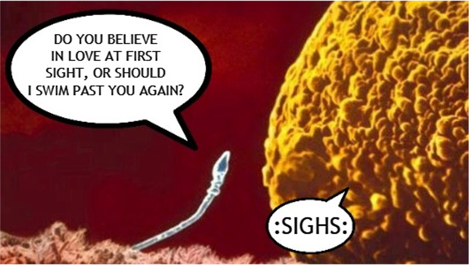

## Lecture 4: Sexual Reproduction

### Keywords

<!--  -->

| 英文                  | 中文       |
| :-------------: | :--------: |
| Sexual Reproduction    | 有性生殖   |
| Meiosis                | 减数分裂   |
| Sperm                  | 精子       |
| Egg                    | 卵子       |
| Fertilization          | 受精       |
| Zygote                 | 受精卵     |
| Haploid                | 单倍体     |
| Diploid                | 二倍体     |
| Homologous chromosomes | 同源染色体 |

### Lesson outline

**A. What is sexual reproduction?**  
1. <u>Sexual reproduction</u> produces an offspring when genetic materials from two 
different sex cells combine.  
a. The female sex cell, a(n) <u>egg</u>, forms in an ovary.  
b. The male sex cell, a(n) <u>sperm</u>, forms in a testis.   
2. During a process called <u>fertilization</u>, an egg cell and a sperm cell join together. The 
new cell that forms is called a(n) <u>zygote</u>.  

**B. Diploid Cells**  
1. Organisms that reproduce sexually make two kinds of cells—<u>body</u> cells and sex cells.  
2. Body cells are <u>diploid</u>; they have pairs of chromosomes.  
3. If a zygote has too many or too few <u>chromosomes</u>, it will not develop properly.  
4. Different organisms have different <u>numbers</u> of chromosomes.  
5. <u>Homologous chromosomes</u> are pairs of chromosomes that have genes for the same traits arranged in the same order.  

**C. Haploid Cells**  
1. Sex cells are <u>haploid</u>; they have only one chromosome from each pair of chromosomes.  
2. In <u>meiosis</u>, one diploid cell divides and makes four haploid cells.  

### Homework  
**Matching**  
1. G  
2. B  
3. H  
4. C  
5. I  
6. A  
7. D  
8. F  
9. E  

**Multiple Choice Questions**  
10. A  
11. B  

**Short Answer Questions**  
12. Sexual reproduction is the production of an offspring that results <u>when the genetic material from two different cells combine</u>.  
(Hint: Check "how to write a definition" in extension)  
s  
13. A zygote is a new cell that forms when <u>an egg cell and a sperm cell join during fertilization</u>.  
(Hint: Check "how to write a definition" in extension)  
s  
14. A diploid cell has pairs of chromosomes and is located in body cells. A haploid cell has only one set of chromosomes and is located in sex cells.  
(Hint: a pair or chromosomes/two sets of chromosomes vs. one chromosome from each pair/one set of chromsomes)

### Extension  
**How to write a definition?**  

A formal definition is based upon a concise, logical pattern that includes as much information as it can within a minimum amount of space. The primary reason to include definitions in your writing is to avoid misunderstanding with your audience. A formal definition consists of three parts:

1. The **term** (word or phrase) to be defined  
2. The **class** of object or concept to which the term belongs  
3. The **differentiating characteristics** that distinguish it from all others of its class  

For example:  

* Water (term) is a liquid (class) made up of molecules of hydrogen and oxygen in the ratio of 2 to 1 (differentiating characteristics).  
* Comic books (term) are sequential and narrative publications (class) consisting of illustrations, captions, dialogue balloons, and often focus on super-powered heroes (differentiating characteristics).  
* Astronomy (term) is a branch of scientific study (class) primarily concerned with celestial objects inside and outside of the earth's atmosphere (differentiating characteristics).  

Sources:  
1. https://owl.purdue.edu/owl/general_writing/common_writing_assignments/definitions.html    
2. https://www.sjsu.edu/aanapisi/docs/DefinitonLessonPlanbyEdSams.pdf  

<!-- \begin{equation*}  -->
<!-- \frac{d}{dx}\left( \int_{a}^{x} f(u)\,du\right)=f(x) -->
<!-- \end{equation*}  -->
