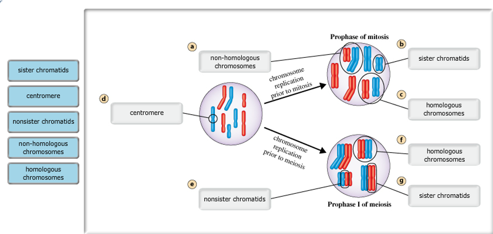

## Lecture 5: Meiosis-1

### Lesson outline  
  

**D. The Phases of Meiosis**  
1. Meiosis involves two divisions of the nucleus and the <u>cytoplasm</u>. These divisions, known as meiosis I and meiosis II, result in four haploid cells.  
2. During <u>interphase</u>, the reproductive cell grows and duplicates its chromosomes.  
3. During meiosis I, each pair of duplicated homologous chromosomes <u>separates</u>.  
4. After meiosis I, the two cells formed during this stage go through a second division of the <u>nucleus</u> and cytoplasm called meiosis II. During meiosis II, sister <u>chromatids</u> separate to produce four haploid cells.  

**E. Why is meiosis important?**  
1. Meiosis forms sex cells with the correct haploid number of <u>chromosomes</u>. This maintains the correct <u>diploid</u> number of chromosomes in organisms when sex cells join. Meiosis creates genetic variation by producing <u>haploid</u> cells.

### Homework  
**Fill in the Blanks**  
1. diploid; haploid  
2. haploid; diploid  
3. diploid  
4. homologous chromosomes  
5. homologous chromosomes  
6. N/A     
7. meiosis  
8. sister chromatids  
9. sister chromatids  
10. meiosis; meiosis  
11. meiosis  
  
**Short Answer Questions**  
12. Sex cells are haploid cells.  

