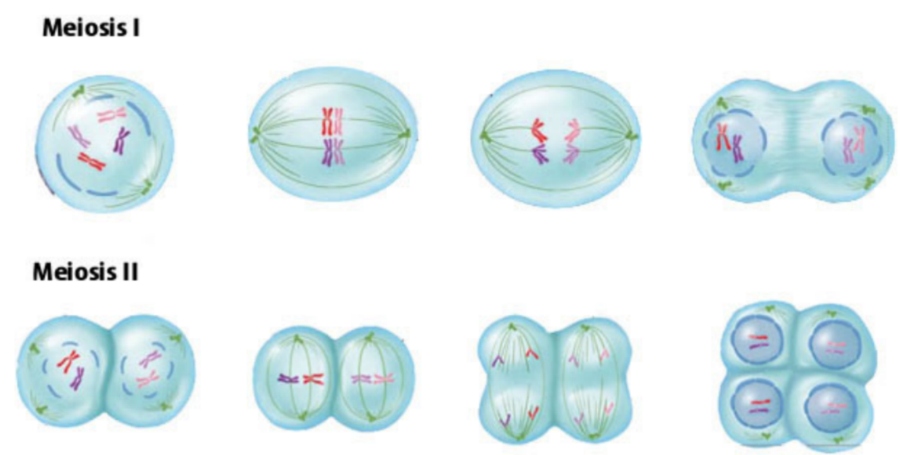
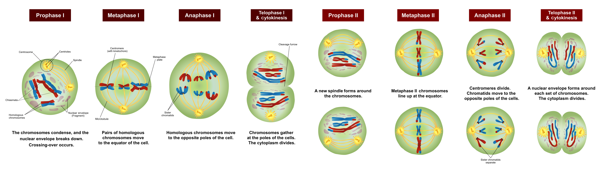
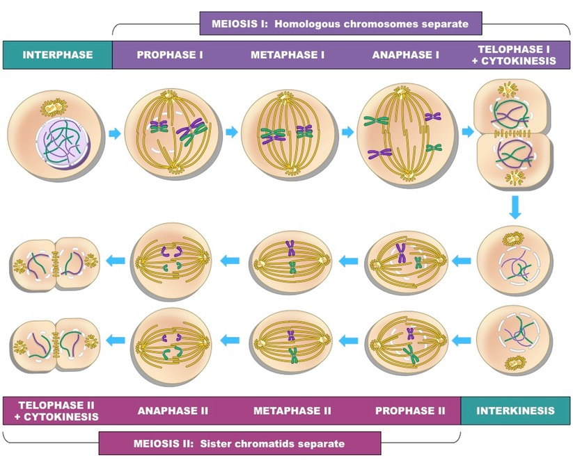

## Lecture 6: Meiosis-2
### Lesson outline  
|  | 
|:--:| 
| *meiosis illustration 1* |  
  
|  | 
|:--:| 
| *meiosis illustration 2* |  
  
|  | 
|:--:| 
| *meiosis illustration 3* |  
  
1. interphase  
2. Homologous chromosomes  
3. breaks  
4. middle  
5. Spindle  
6. homologous  
7. Sister chromatids  
8. two  
9. Sister chromatids  
10. Chromosomes; Nuclear membrane  
11. align  
12. pulled apart; opposite ends of the cells  
13. chromosomes  
14. four  
15. half  

### Homework  
**Multiple Choice Questions**  
1. A  
2. C  
3. D  
4. D  

**Short Answer Questions**  
(6 points maximum) One point for each of the following:  

* Correct description of meiosis (simply rephrasing the question earns no point)  
* DNA replicates in interphase  
* Homologous chromosomes pair in prophase I  
* Spindles move chromosomes pairs to poles in anaphase I  
* Two cycles/rounds of division in meiosis  
* No additional replication before meiosis II  
* Sister chromatids separate to poles in anaphase II  
* 1 germ cell yields 4 gametes  

**Fill in the Blanks**  
1. Anaphase II  
2. N/A  
3. Metaphase I  
4. Telophase II (not quite obvious)  
5. Telophase I (not quite obvious)  
6. N/A  
7. Metaphase II  
8. Prophase I  
9. Prophase II  
10. Anaphase I  
