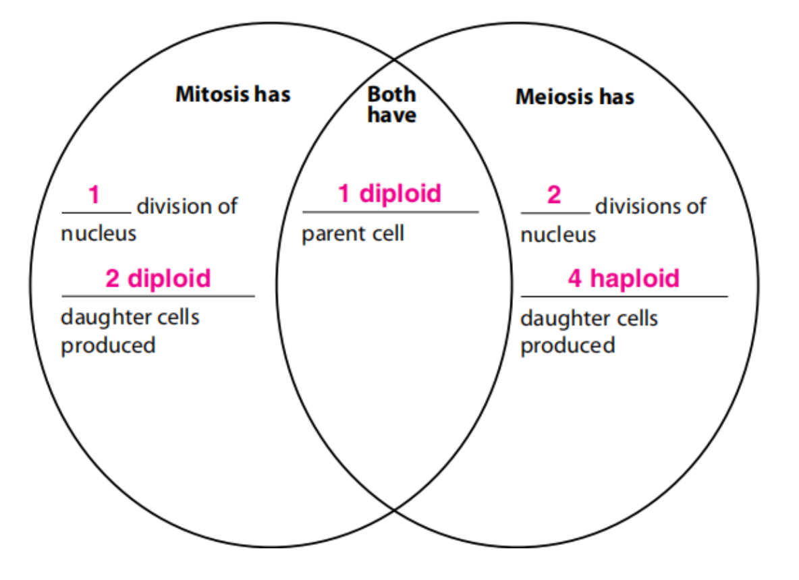

## Lecture 7: Meiosis-3

### Lesson outline  
**F. How do mitosis and meiosis differ?**  
1. During <u>mitosis</u> and cell division, a body cell and its nucleus divide once and produce two identical cells.  
2. During <u>meiosis</u>, a reproductive cell and its nucleus divide twice and produce four cells––two pairs of identical haploid cells.  

**G. Advantages of Sexual Reproduction**  
1. Sexual reproduction produces <u>offspring</u> that have a new combination of DNA. This results in genetic <u>variation</u> among individuals.  
2. Genetic variation gives individuals within a population slight differences that might be an advantage if the <u>environment</u> changes.  
3. <u>Selective breeding</u> has been used to develop desirable traits in plants and animals.  

**H. Disadvantages of Sexual Reproduction**  
1. One disadvantage of sexual reproduction is that organisms have to grow and develop until they are mature enough to produce <u>sex</u> cells.  
2. Another disadvantage is that searching for a mate takes time and energy and might expose individuals to predators, <u>diseases</u>, or harsh environmental conditions.  

Compare and contrast meiosis and mitosis and cell division

**Explain** why genetic variation and selective breeding are advantages of sexual reproduction.  
**Genetic variation**: <u>Instead of being exact genetic copies of parents, members of the same species have different traits, which enable some of them to survive environmental changes.</u>  
**Selective breeding**: <u>The process of choosing and breeding individuals with desirable traits allows breeders to create offspring with those traits.</u>  

**Identify** two main disadvantages of sexual reproduction.  
1. <u>takes time and takes energy</u>  
2. <u>sexual reproduction is limited by certain factors</u> (For example, fertilization cannot take place during pregnancy, which can last as long as two years in some mammals.)  

**Explain** how the process of meiosis relates to the way in which a child resembles but is not an exact copy of his or her parents.  
<u>Observable characteristics in a child, such as **eye color, hair type and color, the shapes of facial features, and height**, resemble those of his or her parents, because the child **inherits portions of DNA from each parent**. A child is not a exact copy of his or her parents because the child **does not carry identical DNA to either parent**.</u>

