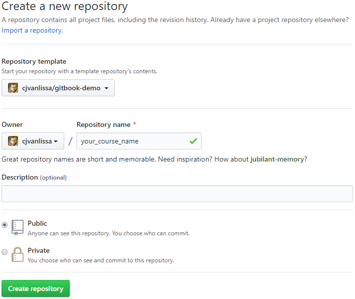
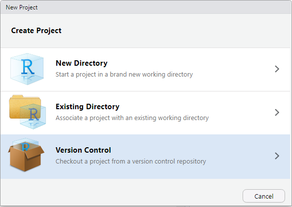
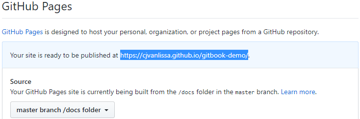

## Lecture 8: Asexual Reproduction

### Keywords  

| 英文                     | 中文          |
| :----------------------: | :-----------: |
| Asexual reproduction     | 无性生殖      |
| Fission                  | 裂殖          |
| Budding                  | 出芽生殖      |
| Regeneration             | 再生          |
| vegetative reproduction  | 营养器官繁殖  |
| Culture medium           | 培养基        |
| Potential                | 潜能          |
| Cloning                  | 克隆          |

### Lesson outline  

**A. What is asexual reproduction?**  
1. In <u>asexual reproduction</u>, one parent organism produces offspring without meiosis and fertilization.  
2. Because the offspring of asexual reproduction inherit all their DNA from one parent, they are genetically <u>identical</u> to each other and their parent.  

**B. Types of Asexual Reproduction**  
1. Cell division in prokaryotes is known as <u>**fission**</u>.  
2. During fission, DNA is <u>copied</u> and the cell splits to form two identical offspring. The original cell no longer exists.  
3. Many unicellular <u>eukaryotes</u> reproduce by **mitotic cell division**. In this type of asexual reproduction, an organism forms two offspring through mitosis and <u>cell division</u>.  
4. In <u>**budding**</u>, a new organism grows on the body of its parent by mitosis and cell division. When the bud becomes large enough, it can break from the parent and live on its own.  
5. <u>**Regeneration**</u> occurs when an offspring grows from a piece of its parent.  
    a. Sea stars, sea urchins, sea cucumbers, and planarians can <u>reproduce</u> through regeneration.  
    b. Many animals can <u>regenerate</u> damaged or lost body parts. This is not reproduction; <u>new individuals</u> are not produced.  
6. <u>**Vegetative reproduction**</u> is a form of asexual reproduction in which offspring grow from a part of a parent plant.  
7. <u>**Cloning**</u> is a type of asexual reproduction developed by scientists and performed in laboratories. It produces <u>identical</u> individuals from a cell or from a cluster of cells taken from a multicellular organism.  
8. Using a cloning method called <u>tissue culture</u>, plant growers and scientists use a meristem to make a copy of a plant with desirable traits.  
9. Because all of a clone’s <u>chromosomes</u> come from one parent, the clone is a genetic copy of its parent.  
10. Asexual reproduction enables organisms to reproduce without a(n) <u>mate</u>.  
11. Asexual reproduction also enables some organisms to rapidly produce a large number of <u>offspring</u>.  
12. Asexual reproduction produces offspring that are genetically identical to each other and to their parent. This results in little genetic <u>variation</u> within a population.  
13. Genetic variation is important because it can increase an organism’s chance of <u>surviving</u> if the environment changes.  
14. Genetic changes, called <u>mutations</u>, can occur and then be passed to offspring; this can affect the offspring’s ability to survive.  

### Homework  

**Matching**  
1.B  
2.A  
3.C  
4.D  
5.F  
6.E  

**Multiple Choice Questions**  
7.D  
8.B  
9.C  
10.C  
11.C  
12.C  
13.B  
14.B  

**Enrichment**  
1. The extreme cold that preserved the woolly mammoths also damaged their cells. 
Scientists need whole cells to clone an animal.  
2. Possible answer: Scientists might be able to understand why the animal became 
extinct. They might also learn more about the animal’s physical characteristics and its behaviors, as well as its environment.  

<!-- To get your GitBook, you should follow these steps: -->

<!-- 1. Go to <https://github.com/cjvanlissa/gitbook-demo> -->
<!-- 2. In the top right of the page, click `Fork`.   -->
<!--     This will copy my `gitbook-demo` repository to your GitHub account.   -->
<!--      -->
<!-- 3. My repository is now copied to your account. It is a template repository, which means that you can create a *new repository* based on this one. -->
<!-- 4. Create a new repository for your own GitBook. Create one for a course you've been wanting to update. In the top-right corner of the GitHub website, click the + icon, and select "New repository":   -->
<!--      -->
<!-- 5. In the dialog, select the `gitbook-demo` as "Repository template", and give the repository an appropriate name for your course. Then, press `Create repository`:   -->
<!--      -->
<!-- 6. Now, go back to Rstudio on your computer. In Rstudio, click `File > New Project`. A dialog will open. If you set up Rstudio with Git correctly, the dialog should have an option to create a new project from Version control. Click it:   -->
<!--      -->
<!-- 7. In the next dialog window, you should copy the URL of the GitHub repository you created in *Step 5*, like so:   -->
<!--      -->
<!-- 8. Now, in Rstudio, you can open files for editing and create new files (explained in the next Chapter). Open files by clicking them in the Files editor (usually in the bottom right of Rstudio):   -->
<!--      -->
<!-- 9. After you make a change, it will show up in the Git tab (usually in the top right of Rstudio). You must Commit the change locally, and then Push the change to GitHub to update your repo. To Commit, select the file and click the Commit button. Write a short message to describe the changes you made, then click the Commit button again. Now, press Push to send your commits to GitHub.   -->
<!--      -->
<!-- 10. To render your book as a GitBook, you must "Build" it. In the top-right panel of Rstudio, you see a "Build" tab. In this tab, simply click the "Build Book" button to build your book. You should see a lot of rendering messages, until a window pops up with your brand new GitBook. If you get errors at this stage, you probably made a mistake in preparing your system (see the previous Chapter).   -->
<!--      -->
<!-- 11. Building the book generated a lot of new files in the `./docs` directory. This directory contains the website files for your GitBook. Open the Git tab again, verify that the `./docs` directory is listed, and Commit and Push all of these new files as described in *Step 9*. -->
<!-- 12. There is only one last remaining task: To publish your GitBook on GitHub pages. Once you do this, any change to the `./docs` folder that you push to GitHub will lead to an immediate update of your GitBook website. Go back to the GitHub page for your Repository. Click on the `Settings` tab on the top right of the page:   -->
<!--      -->
<!-- 13. On the Settings page, scroll all the way down until you reach a section called `GitHub Pages`. There, under the "Source" heading, click the word `None`, and select `master branch /docs folder`. When you select it, the page will update, and if you scroll back down to the `GitHub Pages` section, you will see the URL where your GitBook is published. The first time, it will take a few minutes for your GitBook to come online. When you publish updates to the GitBook however (simply by following *Step 11* again), the update will be near-instantaneous. The Pages section should now look like this (and that is hopefully the link where you found this book):   -->
<!--      -->
