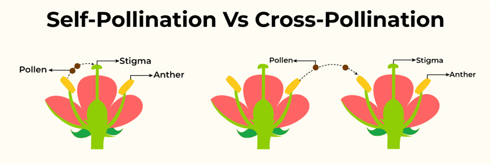
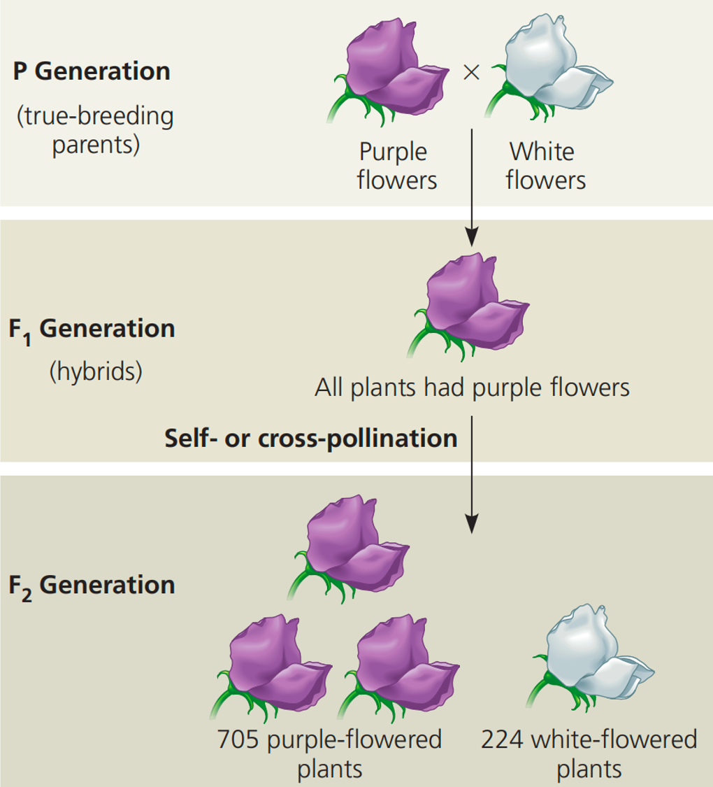

## Lecture 9: Mendel and his Peas - 1

### Keywords  

| 英文              | 中文         | 解释|
| :---------------: | :----------: | :-------------------------------: |
| Trait             | 性状         | characteristic  |
| Heredity          | 遗传         | the passing of traits from parents to offspring |
| Genetics          | 遗传学       | the study of how traits are passed on |
| Self-pollination  | 自花授粉     | a form of pollination when pollen from one plant lands on the pistil of a flower on the same plant  |
| Cross-pollination | 异花授粉     | a form of pollination when pollen from one plant reaches the pistil of a flower on a different plant  |
| Pistil            | 雌蕊         | female organs of a flower  |
| Stigma            | 柱头         | the part of a pistil that receives the pollen during pollination  |
| Stamen            | 雄蕊         | male organs of a flower  |
| Anther            | 花药         | the part of a stamen that contains the pollen  |
| Pollen            | 花粉         | consists of pollen grains, which produce male gametes (sperm cells)  |
| True-breeding     | 纯种         | organisms whose offspring are the same as the parent  |
| Hybrid            | 杂种         | organisms from true-breeding parents with different traits  |

### Lesson outline  

**A. Early Ideas about Heredity**  
1. <u>Heredity</u> is the passing of traits from parents to offspring.  
2. In the 1850s, <u>Gregor Mendel</u>, an Austrian monk, performed experiments that helped answer questions about how traits are inherited.  
3. <u>Genetics</u> is the study of how traits pass from parents to offspring.  
 
**B. Mendel’s Experimental Methods**  
1. Pea plants were ideal for genetic studies because they <u>reproduce</u> quickly; they have easily observed <u>traits</u>; and the experimenter can control which pairs of plants <u>reproduce</u>.  
2. Mendel controlled which plants <u>pollinated</u> other plants.  
&ensp;&ensp;&ensp;&ensp;a. When a(n) <u>true-breeding</u> plant self-pollinates, it always produces offspring with traits that match the parent.    
&ensp;&ensp;&ensp;&ensp;b. By <u>cross-pollinating</u> plants himself, Mendel was able to select which plants pollinated other plants.    
3. With each cross-pollination Mendel did, he recorded the traits that appeared in the <u>offspring</u>.    

**C. Mendel’s Results**  
1. Mendel’s crosses between true-breeding plants with purple flowers produced plants  with only <u>purple</u> flowers. Crosses between true-breeding plants with white flowers produced plants with only <u>white</u> flowers.  
2. Crosses between true-breeding plants with purple flowers and true-breeding plants with white flowers produced plants with only <u>purple</u> flowers.  
3. The first–generation purple-flowering plants are called <u>hybrid</u> plants.  
4. When Mendel cross-pollinated two hybrid plants, the trait that had disappeared in the first generation always <u>reappeared</u> in the second generation.  
5. Mendel analyzed the data from many experiments on seven different <u>traits</u>. He always noted a 3:1 <u>ratio</u>; for example, purple flowers grew from hybrid crosses <u>three</u> times as often as white flowers.

